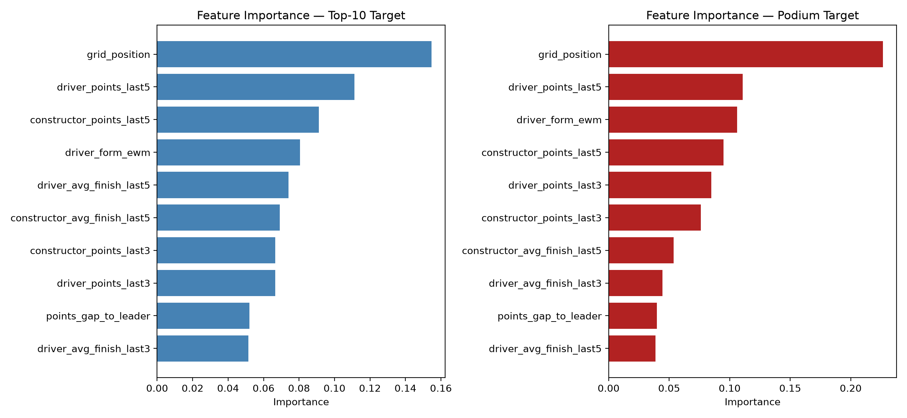
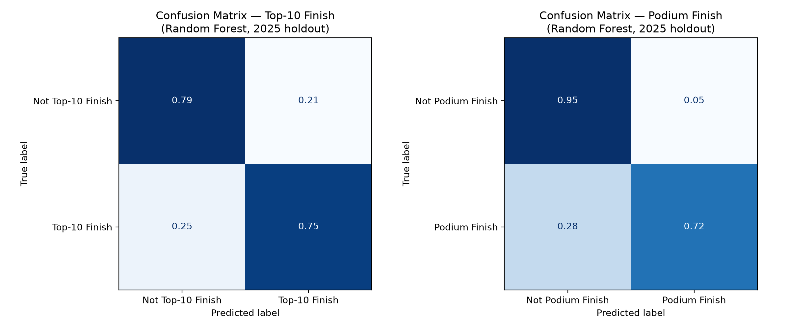
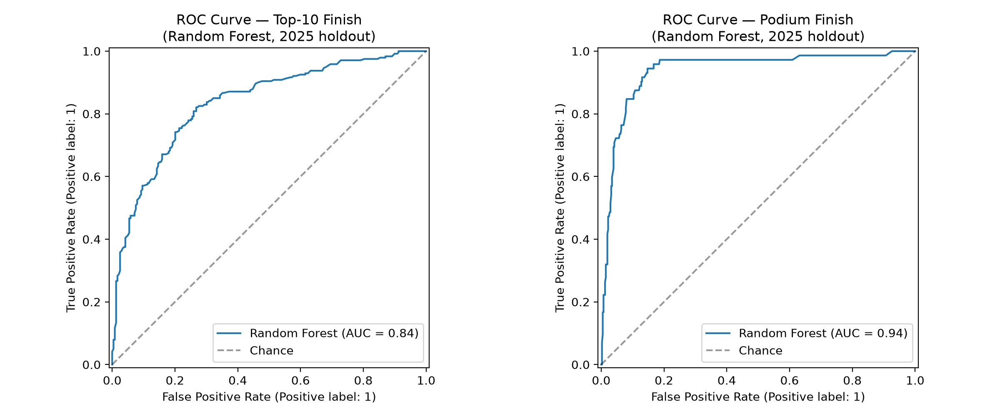
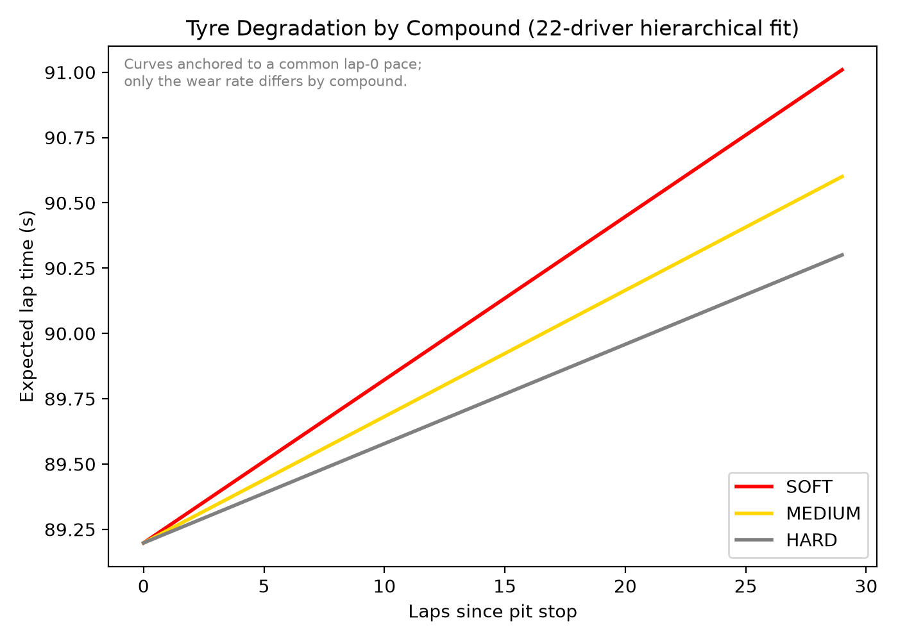
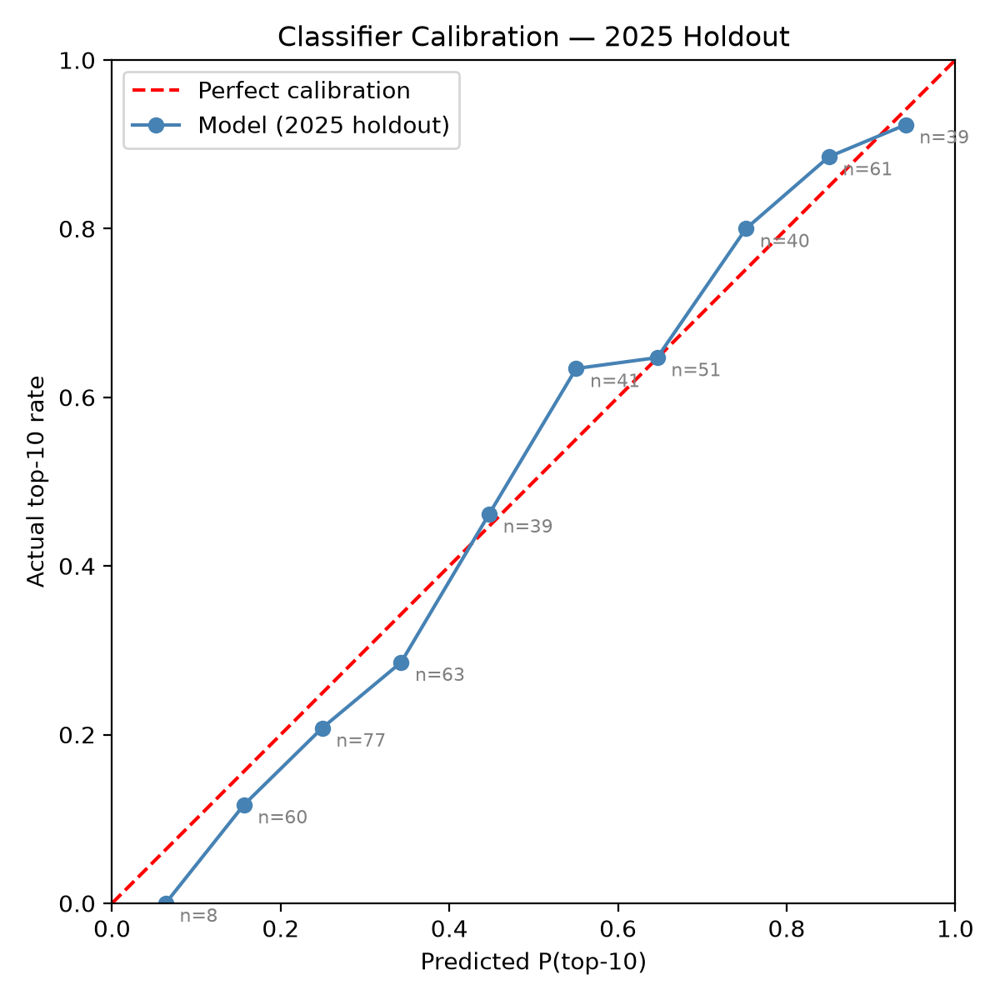
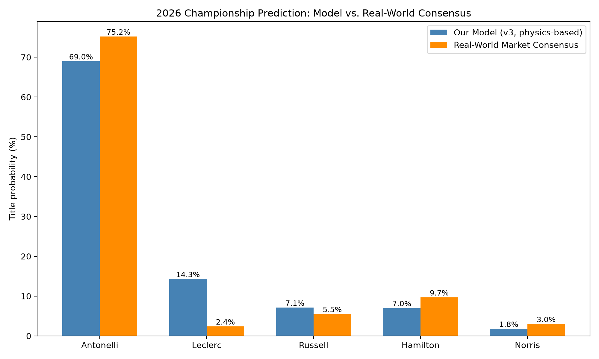
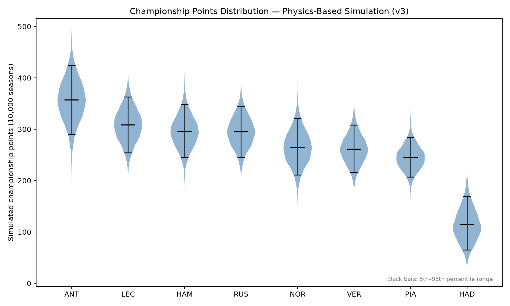

[](https://classroom.github.com/a/-bKyY6qM)
[](https://classroom.github.com/online_ide?assignment_repo_id=23964140&assignment_repo_type=AssignmentRepo)

<div align="center">

# Predicting Formula 1 Race Outcomes: A Machine Learning and Monte Carlo Simulation Approach


**Module:** ACM40960 – Project in Maths Modelling

**Authors:** Adhithiyaram Ramakrishnan (25204180), Tharun Subramanya Sendil (25208175)

**Institution:** University College Dublin

</div>

---

## Table of Contents

- [Overview](#overview)
- [Summary of Results](#summary-of-results)
- [Seasons and Regulatory Context](#seasons-and-regulatory-context)
- [Repository Structure](#repository-structure)
- [Requirements](#requirements)
- [Setup and Usage](#setup-and-usage)
- [Methodology Summary](#methodology-summary)
- [Results](#results)
- [Key Findings](#key-findings)
- [Limitations](#limitations)
- [Project Plan](#project-plan)
- [Data Source and Acknowledgements](#data-source-and-acknowledgements)
- [References](#references)

---

## Overview

This repository contains the full implementation for the group project submitted for ACM40960. The objective is to build a reproducible, end-to-end pipeline for predicting Formula 1 race and championship outcomes, combining:

1. a leakage-safe machine learning classifier trained strictly on pre-race information (grid position, driver and constructor form, regulation era),
2. a hierarchical Bayesian tyre-degradation model, fit across the full 22-driver 2026 grid via partial pooling, and
3. two independent Monte Carlo season simulators — one ranking on classifier confidence, one simulating lap-by-lap race times — each propagating driver and constructor uncertainty forward rather than collapsing to point estimates.

The design of this pipeline is informed by the accompanying literature review, in particular the leakage-safe feature construction of Alahmadi et al. (2026), the state-space tyre degradation model of Cappello and Hoegh (2026), and the uncertainty-propagation methodology of Demsyn-Jones (2019).

## Summary of Results

The pipeline was validated walk-forward against real, unseen 2026 race results — retraining the classifier before each of the 11 rounds completed to date, using only information available at that point in time — achieving a ROC-AUC of 0.794, with calibration checked to within 0.09 of the diagonal on a held-out 2025 season.

The physics-based Monte Carlo simulator (lap-by-lap tyre degradation, fitted grid penalty, pit-stop loss, and per-driver pace variance) places Andrea Kimi Antonelli as the 2026 title favourite at 69.0%, consistent with real-world 2026 betting-market consensus (approximately 74–78%). This result was produced without reference to market data, news reports, or driver sentiment.

## Seasons and Regulatory Context

Formula 1 has undergone substantial regulatory and competitive change across the period covered by this project, which directly shapes how the data is split and how features are constructed. A full account of the technical, power unit, constructor, and driver changes across 2022–2026, and their specific modelling implications, is provided in [`docs/market_analysis.md`](docs/market_analysis.md). In summary:

**2022–2025 (training and validation).** A single, stable regulatory generation: ground-effect aerodynamics (reintroduced 2022) and the 2014 power unit formula, both unchanged through 2025. Seasons 2022–2024 are used for training; 2025 is held out as a validation set within the same regulatory generation. Several constructors changed name within this window while remaining the same operational entity (e.g. Alfa Romeo → Sauber → Kick Sauber), and some drivers changed teams (e.g. Lewis Hamilton, Mercedes → Ferrari); both are handled explicitly rather than left implicit.

**2026 (prediction target).** The largest single-season regulatory change in over a decade: a new power unit formula (50/50 combustion/electric split, MGU-H removed), a new chassis, and active aerodynamics replacing DRS, alongside power unit supplier changes for several teams and the arrival of an eleventh constructor, Cadillac. Because the car and power unit regulations reset simultaneously, constructor-level performance from 2022–2025 cannot be assumed to transfer directly into 2026. This is encoded via `REGULATION_ERA` (tags each season's regulatory generation) and `CONSTRUCTOR_NAME_MAP` (normalises constructor identity across rebrands), and is treated as an explicit source of prediction uncertainty rather than a gap to be smoothed over. This risk is measured directly in the [Results](#results) section rather than assumed.

---

## Repository Structure

```
f1_race_predictor/
├── src/
│   ├── config.py                    # Paths, season split, regulation eras, constructor map, ERA_COLUMNS
│   ├── data_fetch.py                # fastf1 -> tidy CSV, rate-limited
│   ├── features.py                  # Leakage-safe feature engineering (shift + rolling/ewm)
│   ├── model.py                     # Classifier comparison, walk-forward split, feature importance
│   ├── tyre_model.py                # OLS baseline, single-driver and hierarchical Bayesian tyre models
│   ├── qualifying_model.py          # Grid-position regressor for future-round simulation
│   ├── rolling_state.py             # Incremental rolling-form state for recursive simulation
│   ├── season_simulator.py          # v1/v2: classifier-score Monte Carlo (Gumbel-max ranking)
│   ├── full_season_simulator.py     # v2: recursive full-season wrapper
│   ├── race_simulator.py            # v3: lap-by-lap single-race physics simulator
│   ├── race_calendar.py             # Per-circuit lap counts from historical data
│   └── physics_season_simulator.py  # v3: recursive full-season physics wrapper
├── scripts/
│   ├── run_eda.py                       # EDA and diagnostic plots
│   ├── build_features.py                # Builds features.csv
│   ├── train_classifier.py              # Model comparison (Logistic Regression/RF/ET/XGBoost)
│   ├── persist_production_model.py      # Fits and saves production classifier
│   ├── plot_confusion_and_roc.py        # Confusion matrices and ROC curves (Random Forest)
│   ├── fetch_laps.py                    # Lap-by-lap data fetch
│   ├── fit_tyre_model.py                # Single-driver tyre model (Tier 1 and 2)
│   ├── fit_hierarchical_tyre_model.py   # 22-driver hierarchical tyre model
│   ├── fit_qualifying_model.py          # Grid-position regressor
│   ├── fit_grid_penalty.py              # Fitted starting-position time cost
│   ├── fit_pit_stop_loss.py             # Fitted pit-stop time cost
│   ├── build_noise_pool.py              # Pre-drawn skewed-t noise pool
│   ├── build_race_simulator_inputs.py   # Consolidates all Phase 1/2 fitted parameters
│   ├── run_season_simulator.py          # v1: completed-rounds-only simulation
│   ├── run_full_season_simulator.py     # v2: full recursive season (classifier-based)
│   ├── run_physics_season_simulator.py  # v3: full recursive season (physics-based)
│   ├── calibration_check_2025.py        # 2025 held-out calibration
│   └── validate_2026_predictions.py     # Walk-forward validation against real 2026 rounds
├── docs/
│   └── market_analysis.md           # Regulatory and competitive landscape, 2022-2026
├── data/
│   ├── raw/                         # Retrieved race and lap data (not version-controlled)
│   └── processed/                   # Derived tables, predictions, validation results
├── models/                          # Fitted model artefacts (not version-controlled)
├── notebooks/
├── requirements.txt
└── README.md
```

Raw and processed data are excluded from version control (see `.gitignore`) and are regenerated by running the pipeline described below.

---

## Requirements

- Python 3.10+
- Dependencies listed in `requirements.txt` (includes `pandas`, `scikit-learn`, `xgboost`, `pymc`, `arviz`, `h5netcdf`, `h5py`, `fastf1`)

---

## Setup and Usage

```bash
# 1. Environment
python -m venv .venv && source .venv/bin/activate
pip install -r requirements.txt

# 2. Data pipeline (Stage 1-2)
python -m src.data_fetch
python -m scripts.run_eda
python -m scripts.build_features

# 3. Classifier (Stage 3)
python -m scripts.train_classifier
python -m scripts.persist_production_model
python -m scripts.plot_confusion_and_roc

# 4. Tyre degradation model (Stage 4 / Phase 1)
python -m scripts.fetch_laps
python -m scripts.fit_tyre_model                 # single-driver validation
python -m scripts.fit_hierarchical_tyre_model     # full 22-driver hierarchical fit

# 5. Monte Carlo season simulation (Stage 5)
python -m scripts.run_season_simulator            # v1: completed rounds only
python -m scripts.run_full_season_simulator       # v2: full season, classifier-based

# 6. Physics-based simulation (Phase 2-3)
python -m scripts.fit_qualifying_model
python -m scripts.fit_grid_penalty
python -m scripts.fit_pit_stop_loss
python -m scripts.build_noise_pool
python -m scripts.build_race_simulator_inputs
python -m scripts.run_physics_season_simulator    # v3: full season, physics-based

# 7. Validation (Stage 6)
python -m scripts.calibration_check_2025
python -m scripts.validate_2026_predictions
```

Each script prints diagnostics and writes its output to `data/processed/`. Commentary on each stage, including issues identified and resolved during development, is recorded in `PROJECT_STATUS.md`.

---

## Methodology Summary

| Stage | Description |
|---|---|
| 1 | Data pipeline and EDA — `fastf1` fetch, rate-limited, two-layer caching, regulation-era tagging |
| 2 | Feature engineering — leakage-safe rolling/EWM form via `shift(1)` before `rolling()`, cold-start and pit-lane handling |
| 3 | ML classifier — Logistic Regression, Random Forest, Extra Trees, XGBoost; temporal train/validation split |
| 4 | Tyre degradation — OLS baseline validated across three races, then Bayesian state-space model (PyMC, skewed-t noise) |
| 5 | Monte Carlo season simulation — Gumbel-max ranking, two-level variance propagation (Demsyn-Jones, 2019) |
| 6 | Live validation — walk-forward retraining against real, unseen 2026 rounds |
| Phase 1 | Hierarchical multi-driver tyre model — partial pooling across the full 22-driver 2026 grid |
| Phase 2 | Single-race lap-by-lap simulator — fitted grid penalty, pit-stop loss, multi-strategy pit menu |
| Phase 3 | Physics-based full-season simulator — replaces classifier-score ranking with simulated race times |

---

## Results

### Classifier

Beyond accuracy, every model is evaluated on precision, recall, F1, and ROC-AUC, following standard practice for imbalanced binary classification.

**Top-10 Prediction**

| Model | Accuracy | Precision | Recall | F1 | ROC-AUC | Precision@10 |
|---|---|---|---|---|---|---|
| Logistic Regression | 0.752 | 0.798 | 0.675 | 0.731 | 0.840 | 0.754 |
| Random Forest | 0.770 | 0.780 | 0.754 | 0.767 | 0.836 | 0.758 |
| Extra Trees | 0.764 | 0.782 | 0.733 | 0.757 | 0.831 | 0.750 |
| XGBoost | 0.758 | 0.801 | 0.688 | 0.740 | 0.831 | 0.767 |

**Podium Prediction**

| Model | Accuracy | Precision | Recall | F1 | ROC-AUC | Precision@3 |
|---|---|---|---|---|---|---|
| Logistic Regression | 0.868 | 0.538 | 0.889 | 0.670 | 0.941 | 0.708 |
| Random Forest | 0.919 | 0.732 | 0.722 | 0.727 | 0.938 | 0.708 |
| Extra Trees | 0.896 | 0.844 | 0.375 | 0.519 | 0.945 | 0.722 |
| XGBoost | 0.887 | 0.645 | 0.556 | 0.597 | 0.912 | 0.611 |

Random Forest is used as the production model, on the basis of being the most balanced across both targets rather than the top performer on any single metric. XGBoost underperformed on the podium target, which has the fewest positive training examples of the two targets — consistent with boosting's greater sensitivity to hyperparameters on small, imbalanced data.



*Random Forest feature importance for both prediction targets. `grid_position` dominates both, more strongly for podium prediction than top-10.*

**Confusion matrices and ROC curves.** Accuracy alone is not sufficient to characterise a classifier, particularly under class imbalance (only ~15% of podium-target rows are positive). Confusion matrices and ROC curves are reported below for the production model on both targets.



*Row-normalised confusion matrices (Random Forest, 2025 holdout). Each row sums to 1. The podium matrix shows a visible false-negative rate consistent with the 0.722 recall reported above.*



*ROC curves corresponding to the ROC-AUC values reported above (0.836 top-10, 0.938 podium). Both curves bow well above the diagonal chance line; the podium curve bows further, consistent with its higher AUC.*

### Tyre Degradation Model (Phase 1)

| Compound | Degradation Rate |
|---|---|
| Soft | 0.598 |
| Medium | 0.463 |
| Hard | 0.364 |

Fitted on the full 22-driver 2026 grid, dry compounds, using hierarchical partial pooling. `r_hat` at or below 1.02 across every reported parameter; convergence in 725 seconds. The ordering (Soft > Medium > Hard) held consistently across every scale tested during development, from a single-driver fit up to the final 22-driver fit.



*Expected lap time vs. laps since pit stop, by compound, from the population-level fitted degradation rates. All three compounds are anchored to the same fresh-tyre pace at lap 0; the model differentiates compounds by degradation rate only, not starting pace.*

### Validation (Stage 6)

| Check | Value |
|---|---|
| Walk-forward ROC-AUC (11 real, unseen 2026 rounds) | 0.794 |
| Fixed-split ROC-AUC (2025 validation) | 0.836 |
| Calibration | 9/10 bins within 0.09 of the diagonal |



*Predicted P(top-10) vs. actual top-10 rate, 2025 holdout, binned. Point labels show the number of observations in each bin; the lowest-probability bin (n=8) has an implied standard error exceeding its observed deviation from the diagonal and is not treated as evidence of miscalibration.*

### Championship Prediction: Model vs. Real-World Consensus

| Rank | Model (v3, physics-based) | Real-World Consensus |
|---|---|---|
| 1 | Antonelli — 69.0% | Antonelli — approx. 74–78% |
| 2 | Leclerc — 14.3% | Hamilton — approx. 10% |
| 3 | Hamilton / Russell — approx. 7.0% each | Russell — 3rd |

The model identifies the correct 2026 title favourite from lap-time physics alone, without reference to market data. The difference in second place is attributed to the tyre model's current lack of reliability or DNF modelling, listed under Limitations below.



*Model output compared against published real-world 2026 title-probability figures (Polymarket, DraftKings; mid-August 2026), for the two drivers with a directly reported market figure.*



*Distribution of simulated final championship points across 10,000 seasons, top 8 drivers by mean. Black bars mark the 5th–95th percentile range. The overlap between Antonelli's lower tail and the chasing pack's upper tail is the direct visual counterpart of a 69% (not 100%) title probability — variance propagation keeps the outcome uncertain rather than collapsing to a point estimate.*

---

## Key Findings

- `grid_position` is the most important pre-race feature across every prediction target, with a stronger effect on podium prediction than on top-10 prediction, consistent with Alahmadi et al. (2026).
- Driver-level form outranks constructor-level form in feature importance.
- Tyre degradation follows the expected physical ordering only once sufficient data is pooled; small samples produced physically implausible coefficient signs during development (see `PROJECT_STATUS.md` for the wet/intermediate compound case).
- Walk-forward validation shows a measurable performance gap attributable to the regulation change: ROC-AUC falls from 0.836 (2025) to 0.794 (2026, unseen data) — a modest, expected effect consistent with the regulation-reset risk identified before validation, rather than a modelling failure.
- Two-level variance propagation (constructor and driver effects, held fixed per simulated season) prevents championship probabilities from collapsing toward overconfident 0% or 100% outcomes, the failure mode described in Demsyn-Jones (2019).
- The lap-by-lap physics simulation, built without reference to market data, arrives at the same 2026 title favourite identified by real-world betting markets.

## Limitations

- No DNF or reliability modelling. The physics simulator assumes every driver finishes every race; real-world championship outcomes are shaped by reliability, which the current model does not represent.
- Wet and intermediate tyre degradation is fitted as a single grid-wide rate rather than per driver, due to data sparsity. An earlier per-driver fit produced physically implausible coefficients, likely due to safety-car contamination, and was replaced with an explicit fallback.
- No overtaking dynamics in the race simulator. Each driver's race time is computed independently, as if racing alone on track.
- Cadillac cold start. The 2026 entrant has no 2022–2025 history; predictions for this constructor rely on the `is_new_team` flag and season-average imputation rather than a learned pattern.
- Fixed pit-strategy menu, not optimised per race or driver.

---

## Project Plan

| Stage | Description | Status |
|---|---|---|
| 1 | Data pipeline and exploratory analysis | Complete |
| 2 | Feature engineering (leakage-safe, pre-race only) | Complete |
| 3 | Machine learning classifier (top-10 and podium prediction) | Complete |
| 4 | Tyre degradation and single-race simulation | Complete |
| 5 | Monte Carlo season simulation and calibration analysis | Complete |
| 6 | Validation against 2026 season and final report | Complete |
| Phase 1 | Hierarchical multi-driver tyre model (full 22-driver grid) | Complete |
| Phase 2 | Single-race lap-by-lap simulator | Complete |
| Phase 3 | Physics-based full-season Monte Carlo integration | Complete |

---

## Data Source and Acknowledgements

Historical and current race data is retrieved via the open-source [`fastf1`](https://github.com/theOehrly/Fast-F1) Python package, which provides access to official F1 timing data. `fastf1` is unofficial software and is not affiliated with the Formula 1 group of companies.

## References

Full citations and critical discussion are provided in the accompanying literature review submitted for this module. Key sources informing this pipeline:

- Alahmadi, L. et al. (2026). *Predicting Formula One race outcomes using supervised machine learning.* IEEE CSNT 2026.
- Cappello, C. and Hoegh, A. (2026). *A state-space approach to modeling tire degradation in Formula 1 racing.* Journal of Sports Analytics.
- Bansal, A. et al. (2024). *Advanced machine learning approaches for Formula 1 race performance prediction.*
- Demsyn-Jones, R. (2019). *Misadventures in Monte Carlo.* Journal of Sports Analytics.